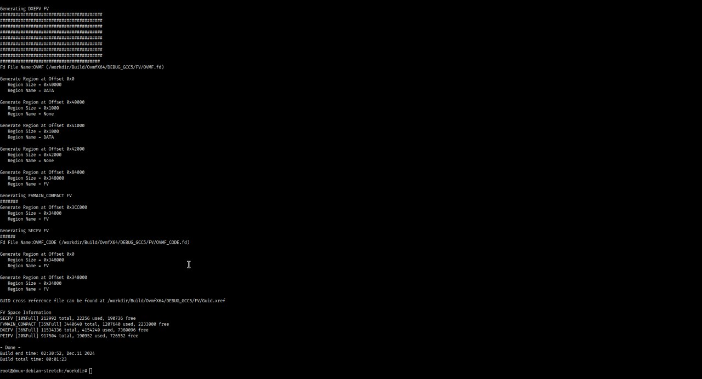
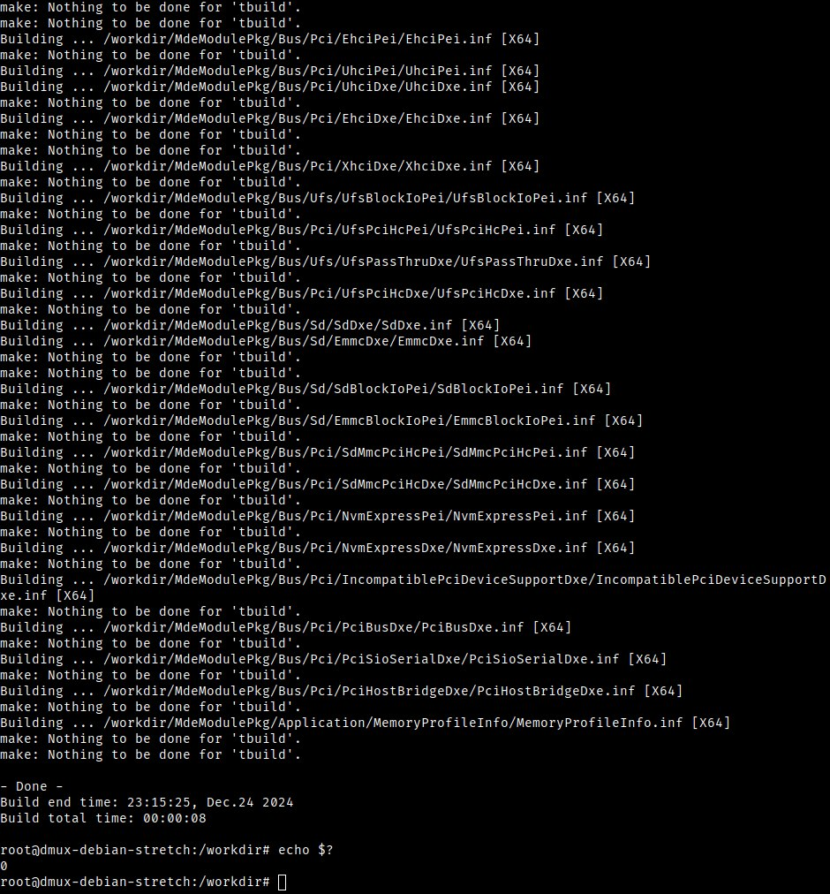
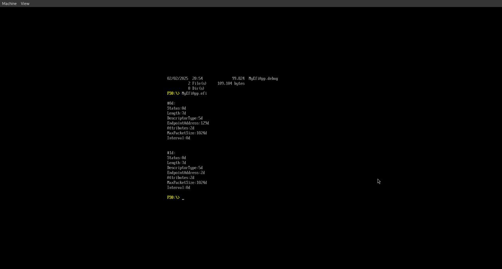
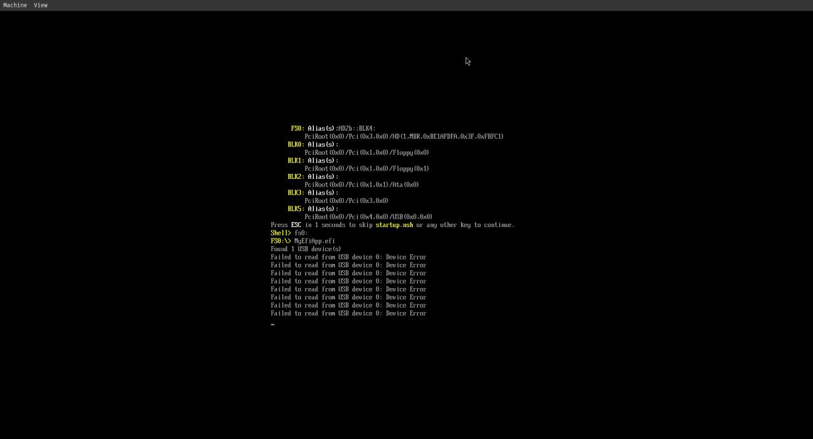

# UEFI Fuzzer

In this project we aim to fuzz the UEFI bootloader similar to the work done in "UEFI Firmware Fuzzing with Simics Virtual Platform". The main difference is that we have chosen QEMU over Simics. Also the deperecated AFL fuzzer is replaced with LibAFL, a library for writing fuzzers in the Rust. An advantage of LibAFL over AFL++—AFL's successor—is its first-class support for QEMU system mode emulation through the `libafl_qemu` library.

## Tools

- QEMU
- EDK II
- LibAFL

## Implementation Details

### Writing an UEFI Application Using EDK II

We develop a simple UEFI application that reads from the USB peripheral in bulk mode and writes the first few bytes to the screen in an infinite loop. The application is written in C and compiled using the EDK II build system.

```
MyEfiApp/
├── MyEfiApp.inf
└── UefiMain.c
```

Here's the content of `MyEfiApp.inf`:

```inf
[Defines]
  INF_VERSION = 1.25
  BASE_NAME = MyEfiApp
  FILE_GUID = 4ae57a00-bfa8-4984-a074-3754a49fd188
  MODULE_TYPE = UEFI_APPLICATION
  VERSION_STRING = 1.0
  ENTRY_POINT = UefiMain

[Sources]
  UefiMain.c

[Packages]
  MdePkg/MdePkg.dec

[LibraryClasses]
  UefiApplicationEntryPoint
  UefiLib
  UefiBootServicesTableLib
  UefiRuntimeServicesTableLib

[Guids]

[Ppis]

[Protocols]
  gEfiUsbIoProtocolGuid
  gEfiDevicePathProtocolGuid

[FeaturePcd]

[Pcd]
```

Here's the content of the `UefiMain.c` which gives us insight into the USB interface and endpoints in our emulation:

```c
#include <Uefi.h>
#include <Library/DebugLib.h>
#include <Library/UefiLib.h>
#include <Library/UefiBootServicesTableLib.h>
#include <Library/UefiRuntimeServicesTableLib.h>
#include <Protocol/UsbIo.h>
#include <Protocol/DevicePath.h>

#define BUFFER_SIZE (1 << 6)

EFI_STATUS
EFIAPI
UefiMain (
  IN EFI_HANDLE        ImageHandle,
  IN EFI_SYSTEM_TABLE  *SystemTable
  )
{
  EFI_USB_IO_PROTOCOL      *UsbIo;
  EFI_USB_INTERFACE_DESCRIPTOR InterfaceDesc;
  EFI_USB_ENDPOINT_DESCRIPTOR EndpointDesc;
  EFI_STATUS                Status;
  UINTN Index;
 
  Status = gBS->LocateProtocol(
    &gEfiUsbIoProtocolGuid,
    NULL,
    (VOID**) &UsbIo
  );

  if (EFI_ERROR(Status)) {
    Print(L"Failed to locate USB protocol: %d\n", Status);
    return Status;
  }

  Status = UsbIo->UsbGetInterfaceDescriptor(
    UsbIo,
    &InterfaceDesc
  );

  for (Index = 0; Index < InterfaceDesc.NumEndpoints; Index++) {
    Status = UsbIo->UsbGetEndpointDescriptor(
      UsbIo,
      Index,
      &EndpointDesc
    );

    Print(L"\n");
    Print(L"#%u:\n", Index);
    Print(L"\tStatus:%u\n", Status);
    Print(L"\tLength:%u\n", EndpointDesc.Length);
    Print(L"\tDescriptorType:%u\n", EndpointDesc.DescriptorType);
    Print(L"\tEndpointAddress:%u\n", EndpointDesc.EndpointAddress);
    Print(L"\tAttributes:%u\n", EndpointDesc.Attributes);
    Print(L"\tMaxPacketSize:%u\n", EndpointDesc.MaxPacketSize);
    Print(L"\tInterval:%u\n", EndpointDesc.Interval);
    Print(L"\n");
  }

  return EFI_SUCCESS;
}
```

And finally, here's the `UefiMain.c` which reads from the USB peripheral in bulk mode and writes the first few bytes to the screen in an infinite loop:

```c
#include <Library/DebugLib.h>
#include <Library/UefiBootServicesTableLib.h>
#include <Library/UefiLib.h>
#include <Library/UefiRuntimeServicesTableLib.h>
#include <Protocol/DevicePath.h>
#include <Protocol/UsbIo.h>
#include <Uefi.h>

#define BUFFER_SIZE (1 << 6)

EFI_STATUS
EFIAPI
UefiMain(IN EFI_HANDLE ImageHandle, IN EFI_SYSTEM_TABLE *SystemTable) {
  EFI_USB_IO_PROTOCOL *UsbIo;
  EFI_USB_INTERFACE_DESCRIPTOR InterfaceDesc;
  EFI_USB_ENDPOINT_DESCRIPTOR EndpointDesc;
  EFI_STATUS Status;
  UINT32 TransferStatus;
  UINT8 Buffer[BUFFER_SIZE];
  UINTN BufferLength;
  UINTN Index;

  Status = gBS->LocateProtocol(&gEfiUsbIoProtocolGuid, NULL, (VOID **)&UsbIo);

  if (EFI_ERROR(Status)) {
    Print(L"Failed to locate USB protocol: %d\n", Status);
    return Status;
  }

  while (true) {
    BufferLength = BUFFER_SIZE;
    Status = UsbIo->UsbBulkTransfer(UsbIo, 0x81, Buffer, &BufferLength, 1000,
                                    &TransferStatus);

    Print(L"Status: %d\n", Status);
    Print(L"Transfer status: %d\n", TransferStatus);

    if (!EFI_ERROR(Status)) {
      Print(L"Read %d bytes from USB device %d\n", TransferStatus, Index);

      // Print the first few bytes in hexadecimal
      for (UINTN i = 0; i < (BufferLength > 16 ? 16 : BufferLength); i++) {
        Print(L"%02x ", Buffer[i]);
      }
      Print(L"\n");
    } else {
      Print(L"Failed to read from USB device %d: %d\n", Index, Status);
    }

    gBS->Stall(100000);
  }
  return EFI_SUCCESS;
}
```

Then we add our UEFI application description to `MdeModulePkg/MdeModulePkg.dsc`.

### Fuzzing with LibAFL

> [!IMPORTANT]  
> This part of the implementation is unfortunately incomplete. We describe our reasoning and the complications which led to our current state.

The reasoning behind choosing LibAFL over AFL++ was its first-class support for QEMU system mode emulation. Unlike AFL++ which only supports QEMU user mode emulation for guiding the fuzzer during fuzzing black-box user-level applications through recognizing its memory access patterns, LibAFL's `libafl_qemu` library provides a way to interact with QEMU system mode emulator from a Rust program. The library is used to start QEMU system emulator with a given firmware image and to communicate with the emulated system. The communication is done through a shared memory region, which is used to pass the input to the emulated system and to receive the output from it. In our case, the input is the USB peripheral input and the output is the result of running the application used to guide the fuzzer and also detect unexpected behaviour implying bugs in implementation.

While LibAFL’s documentation and examples—particularly seen in the `fuzzers/full_system` directory—focus on more typical fuzzing scenarios which utilized system mode emulation, our case involved some challenges that were harder to overcome. Specifically, we were trying to fuzz the firmware by emulating our custom UEFI application that uses the target UEFI API which in turn uses our target implementation, which introduced layers of complexity that the usual examples didn’t have to deal with—they usually were either targetting baremetal code directly running on the emulator or the application/kernel above the UEFI firmware. In other words the main issue was that our use case was different from the typical ones, where fuzzing usually targets either a simple baremetal application or directly the code running on top of the firmware. None of the examples which we found on the Internet or the articles which have released their fuzzer implementation have targeted the UEFI firmware in a similar way as us. This made it hard to find a starting point for our implementation, and we had to figure out how to adapt the existing examples to our specific use case—which was more time-consuming than initially estimated.

## How to Run

### Building the Firmware and the UEFI Application Using EDK II

First we build an EDK2 image following [this documentation](https://wiki.osdev.org/EDK2) on Linux Debian 8, which gives us the firmware binary.

Additionally the command to build our UEFI application is:

```bash
build -a X64 -t GCC5 -p MdeModulePkg/MdeModulePkg.dsc
```

### Emulation Using Qilinq

Qilinq enables emulation within a python venv, for that we install and run qilinq using [this](https://docs.qiling.io/en/latest/install/) and then test a simple python code that tries to emulate x86_64 linux, where the rootfs contains the required files for emulation downloaded either from the qilinq repo or the target environment repo.

```py
ql = Qiling([binary_path], rootfs_path)
```

emulation from M1 Mac is not possible since the emulator looks for a `/dyld` file which is  not located in the rootfs file downloaded from the source!

### Emulation Using QEMU

The OVMF firmware has to be emulated.

```bash
mkdir ovmf-run
cd ovmf-run
cp ../edk2/Build/OvmfX64/DEBUG/GCC5/FV/OVMF.fd bios.bin
qemu-system-x86_64 -drive if=pflash,file=bios.bin,format=raw -drive
if=none,id=hd0,file=fat:rw:hda-contents/,format=raw -device virtio-blk-pci,drive=hd0 -net none
```

In order to run an UEFI application on QEMU we have to mount the directory containing the application binary as a guest disk. Since our application reads from the USB peripheral we also have to define a USB device for QEMU. Ultimately this is the QEMU command which we use to start the emulator:

```bash
qemu-system-x86_64 -drive if=pflash,file=bios.bin,format=raw -drive if=none,id=hd0,file=fat:rw:hda-contents/,format=raw -device virtio-blk-pci,drive=hd0 -device qemu-xhci,id=xhci -drive if=none,id=stick,format=raw,file=/dev/random -device usb-storage,bus=xhci.0,drive=stick -net none
```

## Results

### Building the Firmware and Writing an UEFI Application Using EDK II





### Emulation Using QEMU





## Related Links

- [EDK II](https://github.com/tianocore/edk2)
- [QEMU](https://www.qemu.org/)
- [LibAFL](https://github.com/AFLplusplus/LibAFL)

## Authors

- [@Soroush Sherafat](https://github.com/sorousherafat/)
- [@Kasra Malihi](https://github.com/kasramalih)
- [@Kian Bahadori](https://github.com/kian-bhd)
